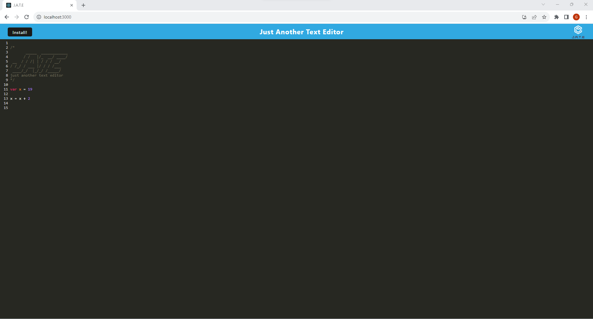
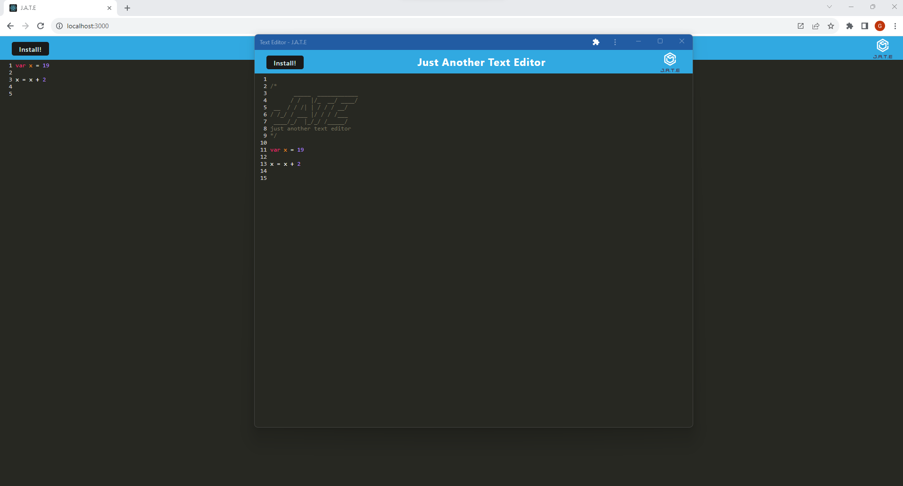

# Code_Text_Editor

## Description

I have continued my research on web development. My research has introduced me to manifest and service workers. Today I will be working on a markup project. I have been given the front end of the project. The project is a text editor for javascript. The text editor just highlights keywords in Javascript. I will be focused on making a manifest and service worker for the project. To accomplish this I will be using react and attaching a webpack to make this project. By the end of this project I should be able to make a webpack to finally make a pwa for this text editor to work offline and online.

## Installation

To install the project you just need to install node and after that just install the project libraries already included in the package.json file.The command below should install the package libraries assuming you have node already installed.  

    npm install.

## Usage

The usage of this project is simple. Users would just run the application and open the website. The website itself does not do much besides highlighting possible Javascript keywords. The website is like a notepad application to just take notes. You can not physically download the code it just stays on the page. The PWA for the project lets users download the project and use it offline. The web app has a button to let users install the project, but if users already downloaded the application then nothing will happen when the button is clicked. 

The image above shows the pwa if you download the application. Something to mention here is that the downloading of the PWA is not avalible in all web browsers. Google and FireFox are two web browers I know that it works on. I have not tested it on other browsers. 

Heroku Link: https://sheltered-springs-47285-3e65035f21f7.herokuapp.com

## Credits

Thank you mdn web docs for helping me understand the database. I got stuck on retreving data from the database.

mdn web docs: https://developer.mozilla.org/en-US/docs/Web/API/IDBObjectStore

## License

The project is covered by the MIT license. Please refer to the repo for more information on the license. The link below we will link users to the template followed to make license.

License Link: https://spdx.org/licenses/MIT.html

## Badges

## Tests

N/A

## Questions

Any questions you may have you can contact me through my email shown below and there is a link to my github account.

Email: gvv8106@gmail.com

GitHub Profile: https://github.com/Giovanne-Villanueva